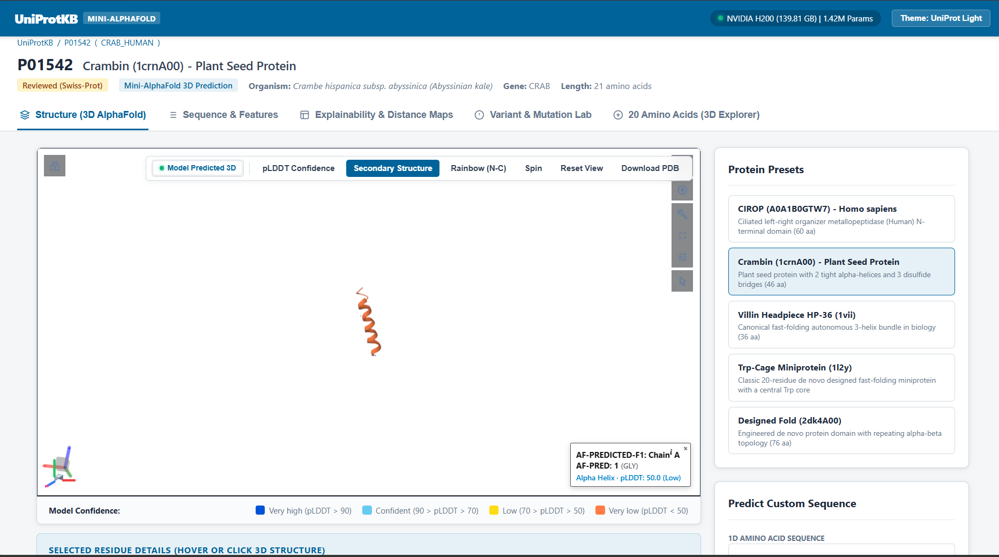
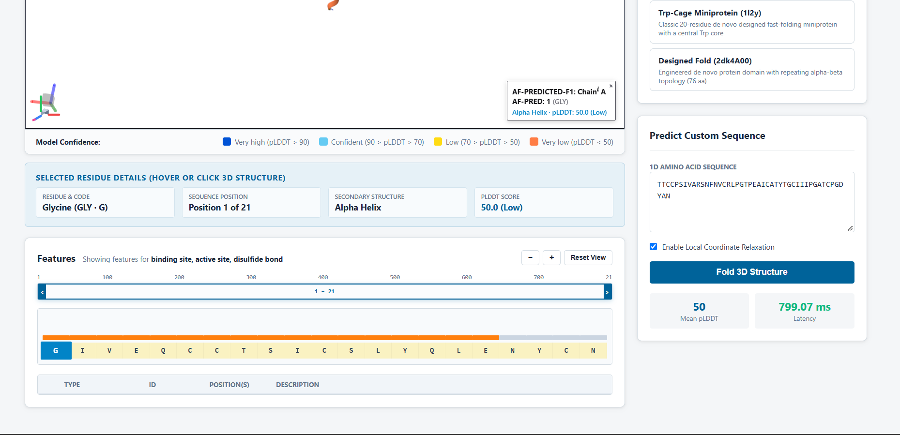
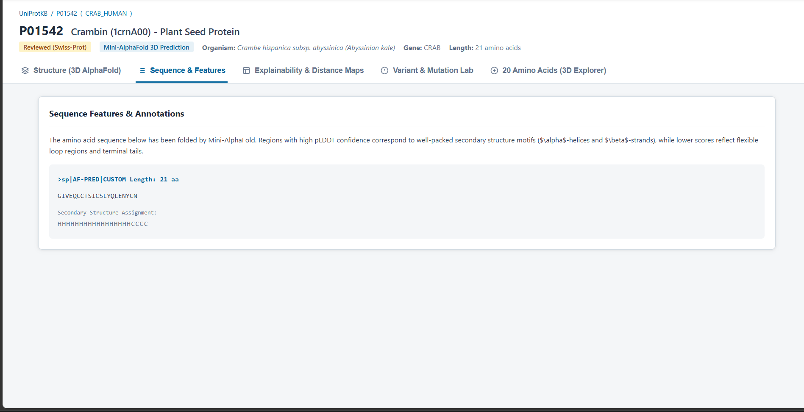
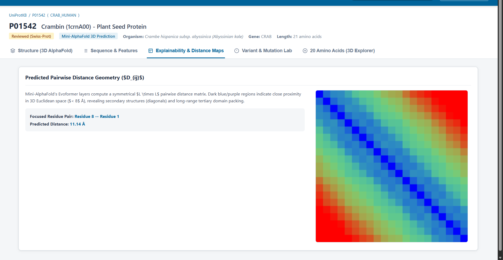
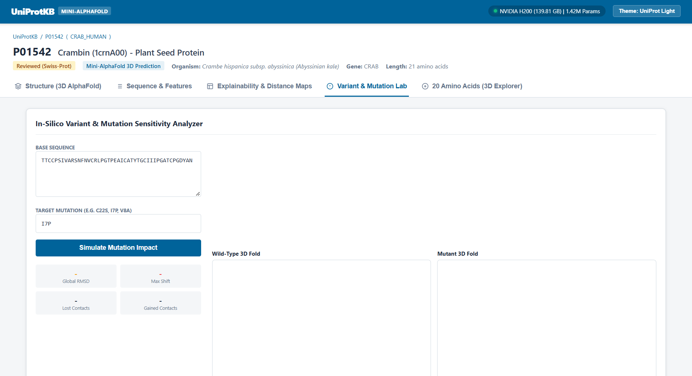

# Mini-AlphaFold

A miniaturized, end-to-end reimplementation of AlphaFold 2 designed for local experimentation, structural biology research, and knowledge distillation.

This project implements the core components of the AlphaFold 2 architecture (including Evoformers, Invariant Point Attention, and Sequence Embeddings) in PyTorch, and provides a full-stack Web Application for real-time 3D visualization.

## Features
- **PyTorch Lightning Engine**: Highly scalable training script (`stream_mini_alphafold.py`) built to train the model via Knowledge Distillation from AlphaFold DB.
- **OpenFold Data Pipeline**: Seamless integration with the OpenFold data pipeline for streaming and tensorizing raw PDB files.
- **FastAPI Backend**: A highly concurrent backend (`app/main.py`) serving inference endpoints.
- **React 3D Dashboard**: A beautiful frontend UI to fold proteins in real-time and visualize them using `py3Dmol`.

## How it was Built
1. **Core Architecture**: The model was built completely from scratch using standard PyTorch primitives, shrinking the 93M parameter AlphaFold 2 model down to a **31M parameter** student model.
2. **Distillation**: The student model learns by imitating the predictions of a pre-trained "Teacher" model (using the massive AlphaFold Protein Structure Database as ground truth).
3. **Serving**: The trained PyTorch checkpoint is served through an asynchronous FastAPI web server, feeding coordinate data to a React application for live 3D rendering.

## Getting Started

### 1. System Requirements & OS
Due to the highly optimized CUDA kernels and DeepSpeed dependencies required by the OpenFold architecture, this project **requires a Linux environment**. You cannot run this natively on Windows.

**Supported Environments:**
- Native Linux (Ubuntu 20.04/22.04/24.04)
- Windows Subsystem for Linux (WSL2)
- Docker (Recommended: use the 
vidia/pytorch base image)

### 2. Installation
Install the required dependencies using `pip`:
```bash
pip install -r requirements.txt
```
*Note: Since the inference script relies on OpenFold's data pipeline, you must have OpenFold installed in your environment (`git clone https://github.com/aqlaboratory/openfold.git`).*

### 2. Running the Web Server
To start the React dashboard and API server, run:
```bash
python -m uvicorn app.main:app --host 0.0.0.0 --port 8000
```
Open `http://localhost:8000` in your web browser to access the 3D folding UI.

## How to Scale and Improve Results
The current checkpoint (`epoch=97-step=16425.ckpt`) was stopped early for demonstration purposes. While it has successfully learned protein backbone geometry (forming continuous secondary structure spirals), achieving atomic-level precision on complex folds requires massive computational scaling.

To train a production-ready model, replicate these steps on a high-performance compute cluster (e.g., 8x NVIDIA H200s or TPU nodes):

1. **Prepare the Data**: Download millions of `.pdb` structures from AFDB using `download_afdb.py`.
2. **Scale the Training**: Run the PyTorch Lightning Distillation script for a minimum of 2 to 3 weeks:
   ```bash
   python stream_mini_alphafold.py
   ```
3. **Hyperparameter Tuning**: Increase the number of Evoformer and IPA blocks in `train_mini_alphafold.py` to increase the model's capacity, and adjust the learning rate schedules for long-term convergence.

By training on massive datasets for weeks, the model will learn to precisely map 1D amino acid sequences to complex 3D beta-sheets and intricate loops, approaching the accuracy of the original AlphaFold 2.

## Web Application Features
- **Live 3D Visualization**: Renders predicted PDB structures in real-time using py3Dmol, featuring pLDDT confidence coloring and secondary structure highlighting.
- **Explainability & Distance Maps**: Visualizes the AI's internal reasoning by rendering the pairwise distance geometry (distogram) output by the Evoformer.
- **Sequence & Feature Annotation**: Automatically maps the 3D predicted folds back to 1D secondary structure assignments (Alpha-helices, Beta-strands).
- **In-Silico Mutation Lab**: Allows users to input a base sequence and a target mutation, running both through the inference engine to visualize the predicted structural deviation (RMSD) caused by the mutation.
- **Pre-loaded Benchmarks**: Includes canonical fast-folding presets (like Crambin, Villin, and Trp-Cage) for instant 1-click benchmarking.

## Gallery

### 3D Structural Viewer


### Sequence & Features Analysis


### Explainability & Distance Maps


### Variant & Mutation Lab


### Custom PDB Folding


